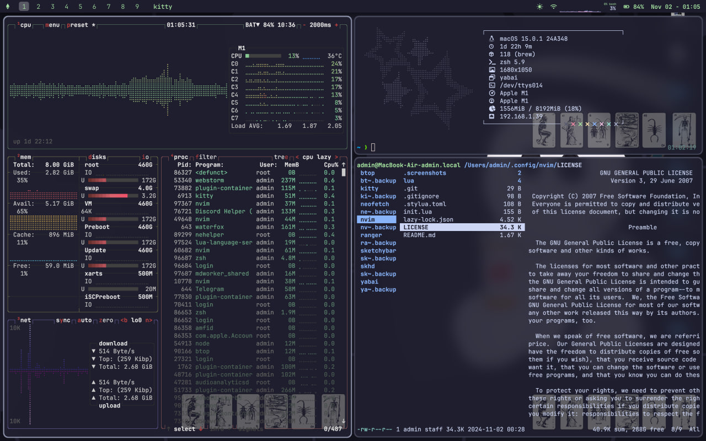
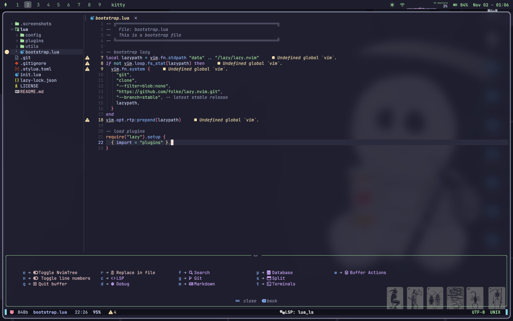

# Dotfiles

Welcome to my dotfiles repository! This repository contains my personal configuration files for various tools and applications that I use across my systems, particularly on macOS and Arch Linux.

## Overview





## Contents

- **`btop`**: Configuration files and themes for btop.
- **`kitty`**: Configuration files for the Kitty terminal emulator.
- **`neofetch`**: Custom configuration for neofetch, including logo.
- **`nvim`**: My personal Neovim configuration, referred to as 0xVim.
- **`ranger`**: Configuration for the ranger file manager.
- **`sketchybar`**: Configuration files for the SketchyBar status bar.
- **`skhd`**: Key binding configuration for skhd.
- **`yabai`**: Configuration files for the yabai window manager.
 
## Installation

To set up my dotfiles on your system, simply run the installation script:

```bash
    bash <(curl -s https://raw.githubusercontent.com/B3AHEH/dotfiles/main/osx_install.sh)
```

This command will automatically configure the necessary applications and settings for your environment. Before installing new configurations, the script will back up your existing configuration files to ensure that you can restore them if needed.

## Acknowledgments

Thanks to the following individuals and their repositories for inspiring me while creating my configuration:

- [`Felix Kratz`](https://github.com/FelixKratz/dotfiles)
